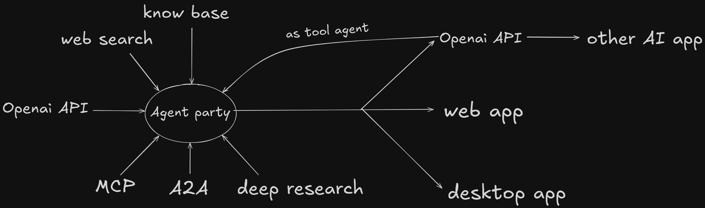
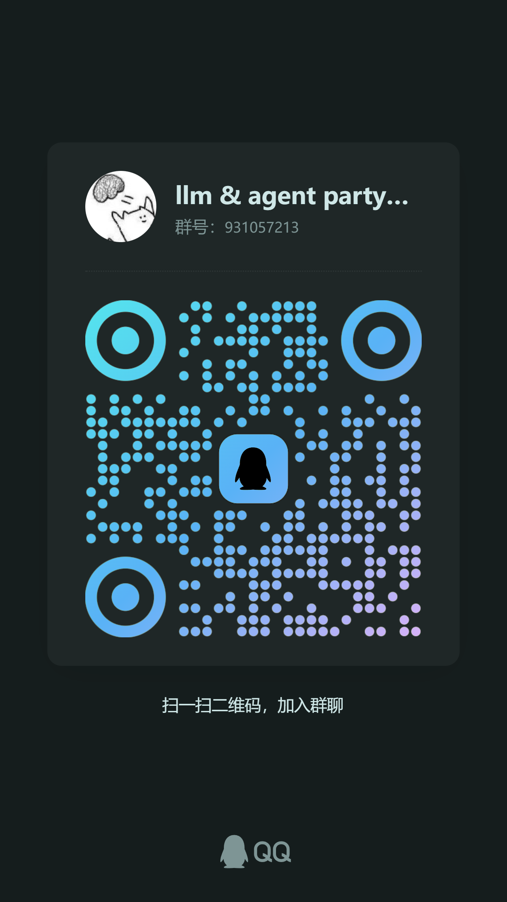

<div align="center">
  <a href="./README_ZH.md"></a>
  <a href="./README.md"></a>
</div>

## Introduction

If you want to transform a large model into an intelligent agent that can access knowledge bases, connect to the internet, utilize MCP services,A2A services, perform deep thinking and in-depth research, and also be usable via OpenAI API calls or directly through web and desktop applications, then this project is for you.



## Demo
https://github.com/user-attachments/assets/1118302b-139a-4b33-ac08-adbde647f573

## Features

0. Switching from the sidebar to the method of invocation, you can view how to call Agent Party either through the Openai API approach or the web interface approach.
1. Knowledge Base: Enables large models to answer based on information within the knowledge base. If there are multiple knowledge bases, the model will proactively query the relevant one based on the question.
2. Internet Connectivity: Allows large models to proactively search for information online based on question requirements. Currently supports:
- [duckduckgo](https://duckduckgo.com/) (completely free, not accessible in China's network environment)
- [searxng](https://github.com/searxng/searxng) (can be deployed locally with Docker)
- [tavily](https://tavily.com/) (requires applying for an API key)
- [jina](https://github.com/jina-ai/jina) (can be used without an API key for web scraping)
- [crawl4ai](https://github.com/unclecode/crawl4ai) (can be deployed locally with Docker for web scraping).
3. [MCP](https://modelcontextprotocol.io/introduction) Service, enabling large models to proactively invoke MCP services based on questioning needs. Currently, it supports three invocation methods: standard input/output, Server-Sent Events (SSE), and websocket.
4. [A2A](https://github.com/google/A2A) Service, enabling large models to proactively invoke A2A services based on questioning needs.
5. Deep Thinking: Transplants the reasoning capabilities of reasoning models into tool-invoking or multimodal models so that large models can use reasoning models for analysis before invoking tools. For example, if deepseek-V3 can invoke tools but the reasoning model deepseek-R1 cannot, the reasoning capability of deepseek-R1 can be transplanted into deepseek-V3 to allow it to reason using deepseek-R1 before invoking tools.
6. In-depth Research: Converts user questions into tasks, gradually analyzes and reasons, invokes tools, checks the output results, and continues analyzing and invoking tools until the task is completed.

## Recent Updates
The following updates have been merged into the main branch but have not yet been released to the release version:
1. Support for the A2A service has been added, allowing the invocation of the A2A service.
2. Support for previewing HTML and Mermaid formats has been added.
3. Improve the tool intelligence agent, so that the intelligence agent built in the agent interface can be used as a tool. 

## Usage

### Windows Desktop Installation

If you are using a Windows system, you can directly [click here to download](https://github.com/heshengtao/super-agent-party/releases/download/v0.1.0/Super.Agent.Party-Setup-0.1.0.exe) the Windows desktop version and follow the prompts to install.

### Docker Deployment

1. Obtain Docker Image (choose one):
- Pull the official image from DockerHub:
```shell
docker pull ailm32442/super-agent-party:latest
docker run -d -p 3456:3456 ailm32442/super-agent-party:latest
```

- Generate image from source code:
```shell
git clone https://github.com/heshengtao/super-agent-party.git
cd super-agent-party
docker pull python:3.12-slim 
docker build -t super-agent-party . 
docker run -d -p 3456:3456 super-agent-party:latest
```

2. Access at http://localhost:3456/

### Source Code Deployment

1. Download Repository:
```shell
git clone https://github.com/heshengtao/super-agent-party.git
cd super-agent-party
```

2. Install Dependencies (Choose one of the following options):
- Windows: Click on the `install.bat` script
- MacOS/Linux: Click on the `install.sh` script
- Or, use pip and npm to install dependencies:
```shell
python -m venv .venv
.venv\Scripts\activate # For Windows
# source .venv/bin/activate # For MacOS/Linux
pip install -r requirements.txt
npm install
```
- Or, use uv and npm to install dependencies:
```shell
uv sync
npm install
```

3. Start the service (choose one of the three options):
- Windows: Click on the script `start_with_dev.bat`
- MacOS/Linux: Click on the script `start_with_dev.sh`
- Or manually execute the following command to start the service:
```shell
.venv\Scripts\activate # windows
# source .venv/bin/activate # macos/linux
npm run dev
```

## Configuration

1. Click on the System Settings in the left sidebar to set language options, system themes, and open this application in web mode.
2. Navigate to the Tools interface in the left sidebar to configure various utilities including current time, in-depth research, and pseudo-reasoning capabilities. If you wish to fix the language used by the agent, you can configure it here.
3. Access the Model Services interface from the left sidebar to configure your preferred cloud service providers such as OpenAI, DeepSeek, etc. Select your model service provider and enter the corresponding API key. Then click the magnifying glass button at the top right corner to fetch the list of models available from that provider, select the desired model to complete the setup.
4. Go to the Agents interface in the left sidebar to configure the system prompt for intelligent agents. The system prompt dictates the behavior of the agent and can be customized according to your needs. When creating an agent, it will snapshot all current configurations including model services, knowledge base, internet access features, MCP services, tools, system prompts, etc.
5. By clicking on the Primary Model and Inference Model interfaces in the left sidebar, you can configure your models more precisely. By default, the first model from the model service provider is selected, but you can choose others. Note! The primary model should have tool invocation capabilities (most inference models do not have these capabilities), while inference models need to have reasoning capabilities.
6. Enter the MCP Services interface from the left sidebar to configure MCP services. Currently, two calling methods are supported: standard input/output and Server-Sent Events (SSE). The standard input/output method requires configuring various parameters of the MCP server; if errors occur, ensure that the local environment has the necessary package managers installed (e.g., uv, npm, etc.). The SSE method requires setting up the MCP server's address.
7. Use the Internet Access Features interface in the left sidebar to configure internet search engines and webpage-to-markdown tools. It currently supports three search engines—DuckDuckGo, SearxNG, Tavily—and two webpage-to-markdown tools—Jina, Crawl4AI. DuckDuckGo requires no configuration, SearxNG requires a Docker image URL, Tavily needs an API key, Jina requires no setup, and Crawl4AI necessitates a Docker image URL.
8. Access the Knowledge Base interface from the left sidebar to configure the knowledge base. Before configuring the knowledge base, you need to complete the configuration of the word embedding model in the Model Services interface on the left sidebar. 
9. Click on the Invocation Methods interface in the left sidebar, you can use the OpenAI format to invoke intelligent agents created within this application. If the model name is `super-model`, it will invoke the currently configured intelligent agent. If the model name corresponds to an Agent ID created in the Agents interface, then it will invoke the specific intelligent agent that you have created. 

## Disclaimer:
This open-source project and its contents (hereinafter referred to as the "Project") are provided for reference only and do not imply any explicit or implicit warranty. Project contributors are not responsible for the completeness, accuracy, reliability, or applicability of the Project. Any reliance on the content of the Project is undertaken at your own risk. Under no circumstances will the project contributors be liable for any indirect, special, or consequential damages arising out of the use of the Project content.

## Support:

### Join Community
If there are issues with the plugin or if you have other questions, feel free to join our community.

1. QQ Group: `931057213`

<div style="display: flex; justify-content: center;">
    
</div>

2. WeChat Group: `we_glm` (Join the group after adding the assistant's WeChat)

3. Discord:[Discord Link](https://discord.gg/f2dsAKKr2V)

### Follow Us
1. To stay updated with the latest features of this project, follow the Bilibili account: [派酱](https://space.bilibili.com/26978344)

### Donate Support
If my work has brought you value, please consider buying me a coffee! Your support not only energizes the project but also warms the creator's heart.☕💖 Every cup counts!
<div style="display:flex; justify-content:space-between;">
    
    
</div> 