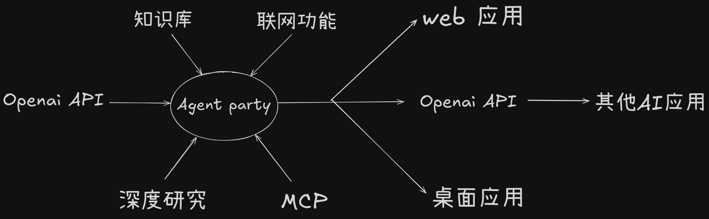

<div align="center">
  <a href="./README_ZH.md"></a>
  <a href="./README.md"></a>
</div>

## 简介

如果你想要让一个大模型变成一个智能体，接入知识库、联网、MCP服务、A2A服务、深度思考、深度研究，并且还能够通过Openai API调用或web端、桌面端直接使用，那么这个项目就是为你准备的。



## 效果演示
https://github.com/user-attachments/assets/1118302b-139a-4b33-ac08-adbde647f573

## 功能

0. 从侧边栏切换到调用方法，可以查看怎么以Openai API的方式或web端方式调用Agent Party。
1. 知识库，让大模型能够根据知识库中的信息进行回答。如果有多个知识库，模型会根据提问需求去主动查询对应的知识库。
2. 联网功能，让大模型能够根据提问需求去主动联网查询信息。目前已支持：
- [duckduckgo](https://duckduckgo.com/)（完全免费，中国网络环境无法访问）
- [searxng](https://github.com/searxng/searxng)（可以docker本地部署）
- [tavily](https://tavily.com/)（需要申请api key）
- [jina](https://github.com/jina-ai/jina)（可以无需api key，用于网页抓取）
- [crawl4ai](https://github.com/unclecode/crawl4ai)（可以docker本地部署，用于网页抓取）。
3. [MCP](https://modelcontextprotocol.io/introduction)服务，让大模型能够根据提问需求去主动调用MCP服务。目前支持三种调用方式：标准输入输出、服务器发送事件 (SSE)、websocket。
4. [A2A](https://github.com/google/A2A)服务，让大模型能够根据提问需求去主动调用A2A服务。
5. 深度思考，可以将推理模型的推理能力移植到可以工具调用或多模态模型中，让大模型在工具调用之前先利用推理模型进行推理分析。例如：deepseek-V3可以工具调用，但是推理模型deepseek-R1无法工具调用，那么就可以将deepseek-R1的推理能力移植到deepseek-V3中，让deepseek-V3在工具调用之前先利用deepseek-R1进行推理分析。
6. 深度研究，将用户的问题转化成任务，逐步分析推理后调用工具，输出结果后会重新检查任务是否完成，如果任务未完成，则继续分析推理后调用工具，直到任务完成。

## 使用方法

### windows桌面版安装

如果你是windows系统，可以直接[点击下载](https://github.com/heshengtao/super-agent-party/releases/download/v0.1.0/Super.Agent.Party-Setup-0.1.0.exe)windows桌面版，然后按照提示进行安装。

### docker部署

1. 获取docker镜像（二选一）：
- 从dockerhub拉取官网镜像：
```shell
docker pull ailm32442/super-agent-party:latest
docker run -d -p 3456:3456 ailm32442/super-agent-party:latest
```

- 从源码生成镜像：
```shell
git clone https://github.com/heshengtao/super-agent-party.git
cd super-agent-party
docker pull python:3.12-slim 
docker build -t super-agent-party . 
docker run -d -p 3456:3456 super-agent-party:latest
```

2. 访问http://localhost:3456/

### 源码部署

1. 下载仓库：
```shell
git clone https://github.com/heshengtao/super-agent-party.git
cd super-agent-party
```

2. 安装依赖（四选一）：
- windows: 点击脚本`install.bat`
- macos/linux:点击脚本`install.sh`
- 或者使用pip和npm安装依赖：
```shell
python -m venv .venv
.venv\Scripts\activate # windows
# source .venv/bin/activate # macos/linux
pip install -r requirements.txt
npm install
```
- 或者使用uv和npm安装依赖：
```shell
uv sync
npm install
```

3. 启动服务（三选一）：
- windows: 点击脚本`start_with_dev.bat`
- macos/linux:点击脚本`start_with_dev.sh`
- 或者手动执行以下命令以启动服务：
```shell
.venv\Scripts\activate # windows
# source .venv/bin/activate # macos/linux
npm run dev
```

## 配置
1. 点击左侧栏的系统设置，可以设置语言选项、系统主题。
2. 点击左侧栏的工具界面，可以配置一些小工具，包括当前时间、深度研究、伪推理能力。如果你想要固定智能体使用的语言，可以在这里配置。
3. 点击左侧栏的模型服务界面，配置你需要调用的云服务商，例如：openai、deepseek等。选择模型服务商并填入对应的API key，然后点击右上角的放大镜按钮，可以获取到该服务商的模型列表，选择你需要的模型，即可完成配置。
4. 点击左侧栏的智能体界面，可以配置智能体的系统提示词，系统提示词决定了智能体的行为，你可以根据你的需求进行修改。当你创建时，智能体会快照你的所有当前配置，包括模型服务、知识库、联网功能、MCP服务、工具、系统提示词等。
5. 点击左侧栏的主模型、推理模型界面，可以更精准的配置你的模型，默认会选择模型服务商中的第一个模型，你也可以选择其他模型。注意！主模型需要有工具调用能力（一般的推理模型都没有工具能力），推理模型需要有推理能力。
6. 点击左侧栏的MCP服务界面，可以配置MCP服务，目前支持两种调用方式：标准输入输出和服务器发送事件 (SSE)。标准输入输出方式需要配置MCP服务器的各类参数，如果报错，请注意本地是否安装对应的包管理器（例如：uv、npm等），SSE方式需要配置MCP服务器的地址。
7. 点击左侧栏的联网功能界面，可以配置联网功能，目前支持三种搜索引擎和两种网页转markdown工具：duckduckgo、searxng、tavily、jina、crawl4ai。duckduckgo不需要配置，searxng需要配置docker镜像地址，tavily需要配置api key，jina不需要配置，crawl4ai需要配置docker镜像地址。
8. 点击左侧栏的知识库界面，可以配置知识库。在配置知识库之前，需要在左侧栏的模型服务界面完成词嵌入模型的配置。
9. 点击左侧栏的调用方法界面，你可以用openai格式来调用本应用创建的智能体，模型名称如果为`super-model`，就会调用当前配置的智能体，模型名称如果为你在智能体界面创建的智能体ID，就会调用你创建的智能体。

## 免责声明：
本开源项目及其内容（以下简称“项目”）仅供参考之用，并不意味着任何明示或暗示的保证。项目贡献者不对项目的完整性、准确性、可靠性或适用性承担任何责任。任何依赖项目内容的行为均需自行承担风险。在任何情况下，项目贡献者均不对因使用项目内容而产生的任何间接、特殊或附带的损失或损害承担责任。

## 支持：

### 加入社群
如果项目存在问题或者您有其他的疑问，欢迎加入我们的社群。

1. QQ群：`931057213`

<div style="display: flex; justify-content: center;">
    
</div>

2. 微信群：`we_glm`（添加小助手微信后进群）

3. discord:[discord链接](https://discord.gg/f2dsAKKr2V)

### 关注我们
1. 如果想持续关注本项目的最新功能，欢迎关注B站账号：[派酱](https://space.bilibili.com/26978344)

### 捐赠支持
如果我的工作给您带来了价值，请考虑请我喝一杯咖啡吧！您的支持不仅为项目注入活力，也温暖了创作者的心。☕💖 每一杯都有意义！
<div style="display:flex; justify-content:space-between;">
    
    
</div>