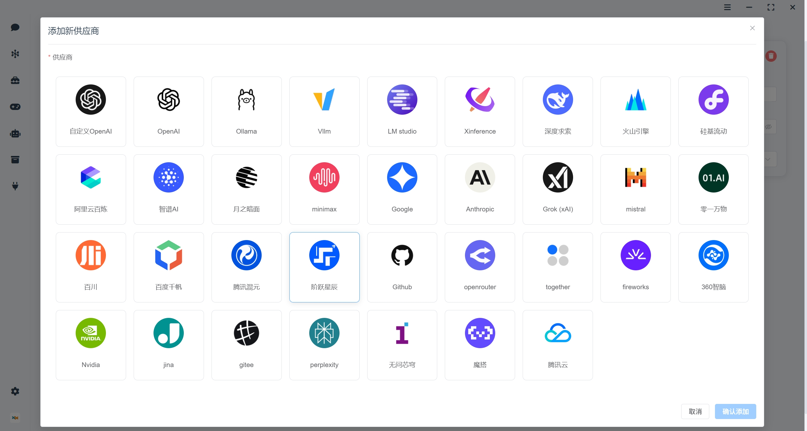
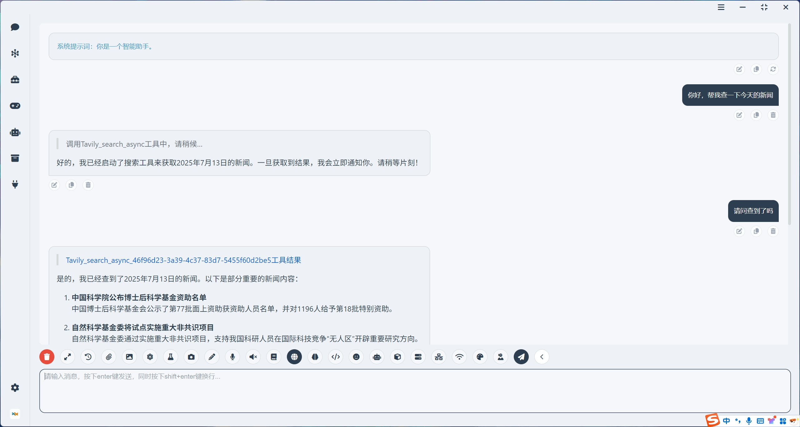
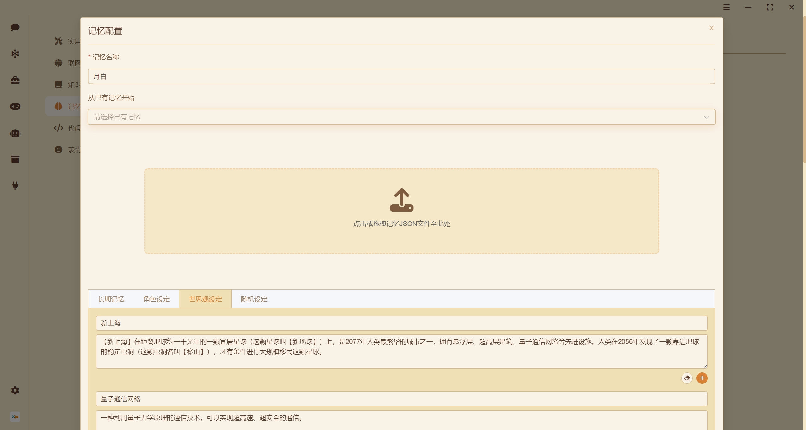
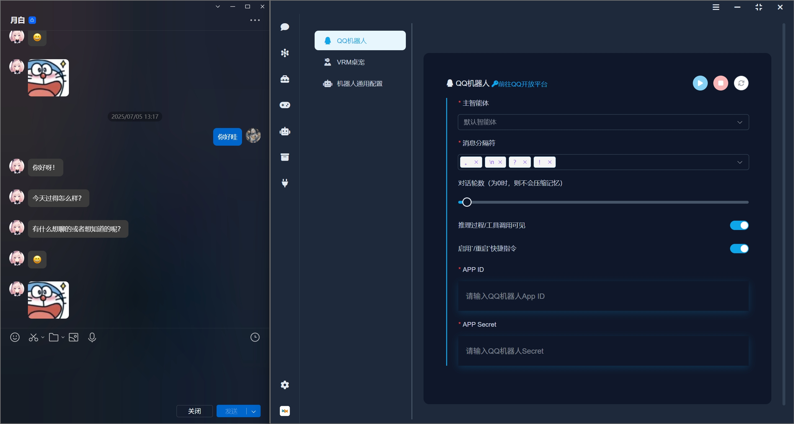
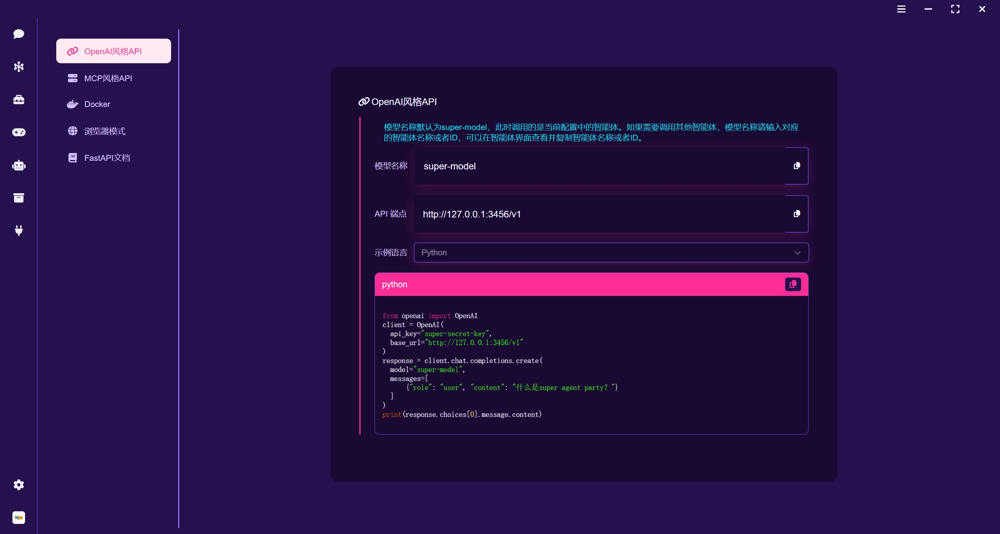
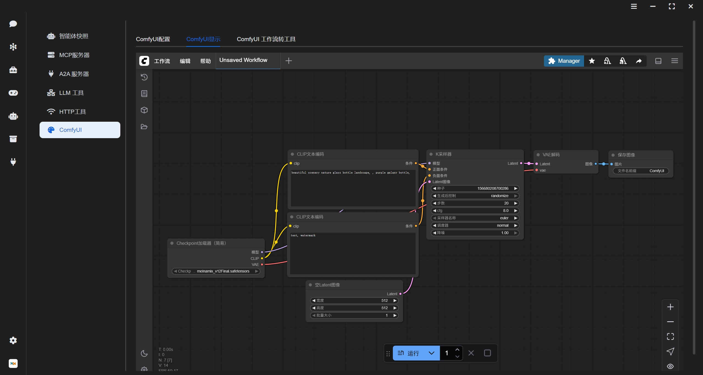

<div align="center">
  <a href="./README_ZH.md"></a>
  <a href="./README.md"></a>
</div>

<div align="center">
  <a href="https://space.bilibili.com/26978344">B站</a> ·
  <a href="https://www.youtube.com/@LLM-party">youtube</a> ·
  <a href="https://gcnij7egmcww.feishu.cn/wiki/DPRKwdetCiYBhPkPpXWcugujnRc">中文文档</a> ·
  <a href="https://temporal-lantern-7e8.notion.site/super-agent-party-211b2b2cb6f180c899d1c27a98c4965d">英文文档</a> 
</div>

## 简介

### 🚀 **一款拥有无限可能的3D版AI桌宠！**

- ✅让LLM API获得企业级能力无需修改一行代码，为您的LLM接口无缝附加知识库、实时联网、永久记忆、代码执行工具、深度思考控制、深度研究、视觉能力、绘图能力、听觉能力、说话能力、自定义工具等高阶功能，打造可插拔的LLM增强中台。
- ✅与此同时，还可以将你的智能体配置，一键部署到任何前端上（已实现经典聊天界面、QQ官方机器人、VRM桌宠）。
- ✅也可以将其他智能体、智能工具、智能工作流作为agent-party智能体的工具使用（已实现comfyui、MCP、A2A）。
- ✅多平台支持：Windows、MacOS、Linux、Docker、Web。


## 软件截图

### 多服务商支持：本地部署引擎以及云服务商接口均支持


### 海量工具：支持异步调用，不阻塞智能体回复


### VRM桌宠：支持上传自定义VRM模型，打造专属桌宠


### 记忆模块：支持永久记忆，支持lorebook世界观构建


### QQ机器人：支持一键部署到QQ官方机器人，方便用户随时随地使用智能体


### 开发者友好：开放openai API接口、MCP接口，可以将智能体对外转接


### 接入comfyui：将comfyui工作流转换为智能体工具，多comfyui服务器负载均衡


## 快速开始

### windows桌面版安装

  👉 [点击下载](https://github.com/heshengtao/super-agent-party/releases/download/v0.2.3/Super-Agent-Party-Setup-0.2.2.exe)

⭐注意！安装时选择仅为当前用户安装，否则启动时需要管理员权限。

### MacOS桌面版安装（beta测试）

  👉 [点击下载](https://github.com/heshengtao/super-agent-party/releases/download/v0.2.3/Super-Agent-Party-0.2.2-Mac.dmg)

⭐注意！下载后将dmg文件周的app文件拖入`/Applications`目录下，然后打开终端，执行以下命令并输入root密码，从而移除从网络下载附加的Quarantine属性：

  ```shell
  sudo xattr -dr com.apple.quarantine  /Applications/Super-Agent-Party.app
  ```

### Linux 桌面版安装

我们提供了两种主流的 Linux 安装包格式，方便你在不同场景下使用。

#### 1. 使用 `.AppImage` 安装（推荐）

`.AppImage` 是一种无需安装、即开即用的 Linux 应用格式。适用于大多数 Linux 发行版。

  👉 [点击下载](https://github.com/heshengtao/super-agent-party/releases/download/v0.2.3/Super-Agent-Party-0.2.2-Linux.AppImage)

#### 2. 使用 `.deb` 包安装（适用于 Ubuntu / Debian 系统）

  👉 [点击下载](https://github.com/heshengtao/super-agent-party/releases/download/v0.2.3/Super-Agent-Party-0.2.2-Linux.deb)

### docker部署（推荐）

- 两行命令安装本项目：
  ```shell
  docker pull ailm32442/super-agent-party:latest
  docker run -d -p 3456:3456 -v ./super-agent-data:/app/data ailm32442/super-agent-party:latest
  ```

- ⭐注意！`./super-agent-data`可以替换为任意本地文件夹，docker启动后，所有数据都将缓存到该本地文件夹，不会上传到任何地方。

- 开箱即用：访问http://localhost:3456/

### 源码部署

- windows ：
  ```shell
  git clone https://github.com/heshengtao/super-agent-party.git
  cd super-agent-party
  uv sync
  npm install
  start_with_dev.bat
  ```

- linux or mac ：
  ```shell
  git clone https://github.com/heshengtao/super-agent-party.git
  cd super-agent-party
  uv sync
  npm install
  chmod +x start_with_dev.sh
  ./start_with_dev.sh
  ```

## 使用方法

- 桌面端：点击桌面端图标即可开箱即用。

- web端或docker端：启动后访问http://localhost:3456/

- API调用：开发者友好，完美兼容openai格式，可以流式输出，完全不影响原有API的反应速度，无需修改调用的代码：

  ```python
  from openai import OpenAI
  client = OpenAI(
    api_key="super-secret-key",
    base_url="http://localhost:3456/v1"
  )
  response = client.chat.completions.create(
    model="super-model",
    messages=[
        {"role": "user", "content": "什么是super agent party？"}
    ]
  )
  print(response.choices[0].message.content)
  ```

- MCP调用：启动后，在配置文件中写入以下内容，即可调用本地的mcp服务：

  ```json
  {
    "mcpServers": {
      "super-agent-party": {
        "url": "http://127.0.0.1:3456/mcp",
      }
    }
  }
  ```

## 功能

主要功能请移步以下文档查看：
  - 👉 [中文文档](https://gcnij7egmcww.feishu.cn/wiki/DPRKwdetCiYBhPkPpXWcugujnRc)
  - 👉 [英文文档](https://temporal-lantern-7e8.notion.site/super-agent-party-211b2b2cb6f180c899d1c27a98c4965d)

## 免责声明：
本开源项目及其内容（以下简称“项目”）仅供参考之用，并不意味着任何明示或暗示的保证。项目贡献者不对项目的完整性、准确性、可靠性或适用性承担任何责任。任何依赖项目内容的行为均需自行承担风险。在任何情况下，项目贡献者均不对因使用项目内容而产生的任何间接、特殊或附带的损失或损害承担责任。

## 许可证协议

本项目采用双许可证授权模式：
1. 默认情况下，本项目遵循 **GNU Affero General Public License v3.0 (AGPLv3)** 授权协议
2. 若需将本项目用于闭源的商业用途，必须通过项目管理员获取商业授权许可

未经书面授权擅自进行闭源商业使用的，视为违反本协议约定。AGPLv3 完整文本可在项目根目录的 LICENSE 文件或 [gnu.org/licenses](https://www.gnu.org/licenses/agpl-3.0.html) 查阅。

## 支持：

### 关注我们
<a href="https://space.bilibili.com/26978344">
  
</a>
<a href="https://www.youtube.com/@LLM-party">
  
</a>

### 加入社群
如果项目存在问题或者您有其他的疑问，欢迎加入我们的社群。

1. QQ群：`931057213`

<div style="display: flex; justify-content: center;">
    
</div>

2. 微信群：`we_glm`（添加小助手微信后进群）

3. discord:[discord链接](https://discord.gg/f2dsAKKr2V)

### 捐赠支持
如果我的工作给您带来了价值，请考虑请我喝一杯咖啡吧！您的支持不仅为项目注入活力，也温暖了创作者的心。☕💖 每一杯都有意义！
<div style="display:flex; justify-content:space-between;">
    
    
</div>